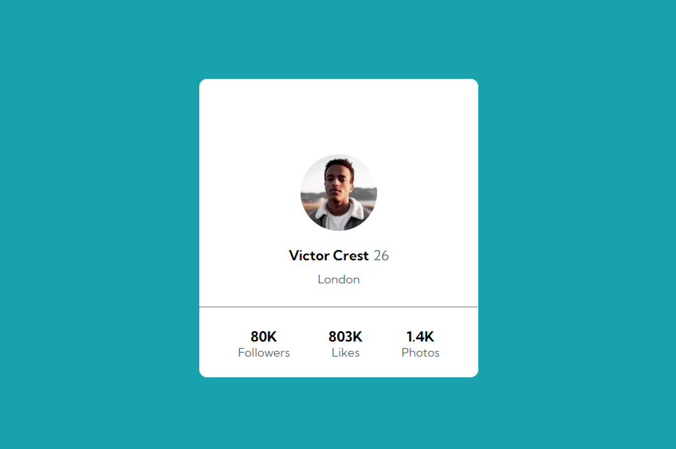

# Card com Flexbox - Solução do exercício do CSS Avançado - Flexbox 


Esta é uma solução para o exercício proposto na aula de CSS Avançado - Flexbox. Os desafios do Frontend Mentor ajudam você a melhorar suas habilidades de codificação através da construção de projetos realistas. 

## Índice

- [Overview](#overview)
  - [O desafio](#o-desafio)
  - [Print do projeto](#print-do-projeto)
  - [Link](#link)
- [Meu processo](#meu-processo)
  - [Construído com](#construido-com)
  - [O que aprendi](#o-que-aprendi)
  - [Desenvolvimento contínuo](#desenvolviment-continuo)
- [Autora](#autora)
- [Agradecimentos](#agradecimentos)

## Overview

### O desafio

O desafio constiste em:

- testar nossos conhecimentos com front-end, mas expecificadamente o CSS, na parte de flexbox;
- mostrar nossa capacidade em utilizar as propriedades relacionadas ao flex e seus atributos;

### Print do projeto

 

### Link

- Código do desenvolvimento: [NFT Card](https://github.com/maiarasteffen/card-flexbox)
- Front do projeto: [Front](https://timely-cocada-db815d.netlify.app/)

## Meu processo

### Construído com

- Semântica HTML;
- Propriedades CSS;
- Flexbox;
- Positions;
- Variáveis no CSS;

### O que aprendi

Aprendi como utilizar e centralizar os elementos como flexbox, propriedades mais usadas foram: display, justify-content e align-itens.

Código utilizado:

```html
<body>
  <main class="container">
    <div class="card">
      <div class="profile">
        
        <h3>Victor Crest<span class="age">26</span></h3>
        <p class="city">London</p>
      </div>
      <hr>
      <ul class="likes-number">
        <li class="info">
          <h3>80K</h3>
          <span class="counter-type">Followers</sp>
        </li>
        <li class="info">
            <h3>803K</h3>
            <span class="counter-type">Likes</span>
        </li>
        <li class="info">
            <h3>1.4K</h3>
            <span class="counter-type">Photos</span>
        </li>
      </ul>
    </div>
  </main>
</body>
```
```css
@import url('https://fonts.googleapis.com/css2?family=Kumbh+Sans:wght@400;700&display=swap');

body{
    background-color: var(--background-color);
    height: 100vh;
    font-family: 'Kumbh Sans', sans-serif;
    font-size: 15px;
}

.container {
    display: flex;
    justify-content: center;
    align-items: center;
    height: 100%;
}

.container .card {
    display: flex;
    flex-direction: column;
    align-items: center;
    justify-content: space-between;
    gap: 25px;
    background-color: #fff;
    border-radius: 10px;
    margin: 20px;
    width: 350px;
    height: 375px;
}

.container .card .profile {
    display: flex;
    flex-direction: column;
    justify-content: space-around;
    align-items: center;
    gap: 10px;
    height: 100%;
}

.container .card .profile .avatar {
    border-radius: 50%;
    margin-top: 95px;
    margin-bottom: 10px;
}

.container .card .profile .age {
    font-weight: 100;
    margin-left: 5px;
    color: var(--text-color);
}

.container .card .profile .city {
    color: var(--text-color);
}

hr {
    width: 100%;
}

.container .card .likes-number {
    display: flex;
    align-items: center;
    justify-content: space-evenly;
    width: 100%;
    padding-bottom: 75px;
    text-align: center;
}

.container .card .likes-number .counter-type {
    color: var(--text-color);
}
```

### Desenvolvimento contínuo

Irei continuar me aperfeiçoando na parte de CSS, focando no Flexbox e Grid. Além de estilizar elementos com pseudo-elementos. Também daqui em diante irei me aperfeiçoar na área de React Native e Rest API com Node.js! Por isso estou treinando bem a base do Front-end!

## Author

- Linkedin - [Maiara Steffen](https://www.linkedin.com/in/maiara-steffen/)
- Frontend Mentor - [@maiarasteffen](https://www.frontendmentor.io/profile/maiarasteffen)
- Instagram - [@maiara_steffen](https://www.instagram.com/maiara_steffen/)
- GitHub - [@maiarasteffen](https://github.com/maiarasteffen/)

## Agradecimentos

Primeiro quero agradecer muito a Deus por sempre estar me dando oportunidades de me desenvolver cada vez mais na carreira de programadora, também quero agradecer muito ao [Dev Em Dobro](https://www.instagram.com/devemdobro/), os irmãos que me ensinam muitas pessoas a se desenvolverem e crescerem no mercado de trabalho como programador!
